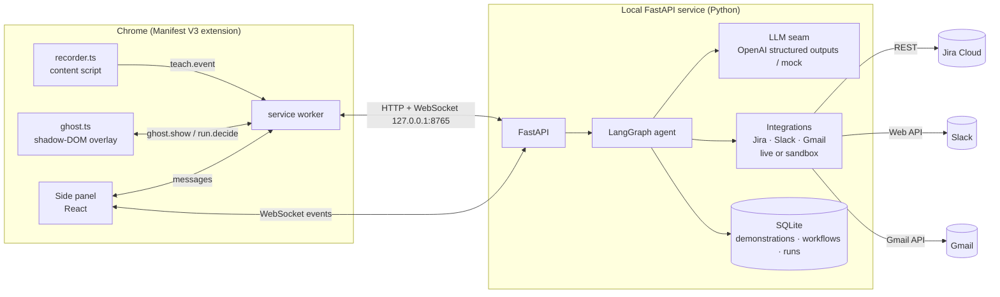

# REPEAT architecture

REPEAT has three moving parts, all on the user's machine:



Nothing leaves the machine except calls to the LLM (to generalise, match, plan and assess
risk) and calls to the target apps' official APIs when the user approves a run.

## The two graphs

Both are LangGraph `StateGraph`s compiled with a shared `MemorySaver`, so a human decision
can be delivered later with `Command(resume=...)` against the same thread id.

### Teach graph (thread id = demonstration id)

```
START → observe → generalize → record → END
           ╲          ╲          ╲
            └──────────┴──────────┴──→ failure_gate ──(retry)──→ back to the failing node
                                              └──(stop)──→ END
```

| Node | Does | Fails when | Then |
|---|---|---|---|
| `observe` | Sorts events, collapses repeated `input` events on one field to the final value, drops empty clicks, attaches narration segments to the nearest event within 8 s. | No usable events. | Not retryable: the gate offers **stop** only, with the sentence "No usable events were recorded; try the demonstration again." |
| `generalize` | Calls the LLM with the `generalize` prompt and a strict JSON schema; builds `Workflow{trigger, variables, steps}`. | LLM error, schema rejection (after one internal retry), or zero steps. | Gate offers **retry / stop**. |
| `record` | Saves workflow + demonstration to SQLite, publishes `workflow.learned`. | SQLite write fails. | Gate offers **retry / stop**. |

### Run graph (thread id = run id)

```
START → match ─(no)─→ END
          │(yes)
          ▼
        plan → assess_risk → await_approval ⏸ ─(dismiss)─→ END
                                  │(step)            │(all)
                                  ▼                  ▼
                            step_gate ⏸ ──────→ execute → verify → record ─┐
                                  ▲   (stop→END)                            │
                                  └────────(step mode, more steps)──────────┤
                                            (all mode, more steps) → execute┘
                                            (no more steps) → END
        plan / assess_risk / execute / verify ──(failure)──→ failure_gate ⏸
              failure_gate ──retry──→ the failing node
                           ──skip───→ record   (step marked `skipped`)
                           ──stop───→ END      (run marked `stopped`)
```

⏸ marks an `interrupt()`. The HTTP layer surfaces the pending interrupt as
`{type: approval | step_gate | failure, options: [...]}` and the panel / ghost render it.

| Node | Does | Failure handling |
|---|---|---|
| `match` | LLM decides whether the opened email matches the trigger; stores confidence and a one-sentence reason. | If the LLM cannot be reached the run is marked `stopped` with reason "Could not evaluate this email (…)". The ghost stays silent; the panel shows why. Never guesses. |
| `plan` | LLM fills email-sourced variables (`email_subject`, `email_body`, `reporter`). Any variable the model skipped is filled directly from the email so no template is left dangling. Builds the `RunStep` list with rendered inputs. | LLM failure → `failure_gate` with **retry / stop** (skip makes no sense before the first commit). |
| `assess_risk` | LLM computes `external_messages / records_created / modified / deleted`, a one-line blast radius and a level. | LLM failure → `failure_gate` with **retry / stop**. |
| `await_approval` | `interrupt()` with the risk summary. Resumes with `step`, `all` or `dismiss`. | Dismiss marks the run `stopped`; nothing has been committed yet. |
| `step_gate` | In step mode, re-renders the step's templates with everything known so far (so the Slack draft shows the real `DEMO-142`), marks it `previewing`, then `interrupt()`s. Tab → `commit`, ⇧Tab → `all`, Esc → `stop`. | Stop marks the run `stopped`; earlier commits stay undoable. |
| `execute` | Calls the integration for the step (Jira create, Slack post, Gmail label). Stores outputs, the **undo token** and result URL; merges outputs into run variables. | `IntegrationError` → step `failed`, run `paused`, one-sentence reason from the integration ("Jira refused the issue: …", "Slack error: channel_not_found."). Gate offers **retry** (up to 3 attempts, only if the error is retryable), **skip**, **stop**. |
| `verify` | Independently confirms the record exists through the API (`GET issue`, `conversations.history`, label present on message). | Not found or network error → step `failed`, run `paused`, gate offers **retry / skip / stop**. A step is never marked `done` without a passing verification. |
| `record` | Advances the cursor, writes the timeline, computes time saved and completes the run when no steps remain. | Store errors propagate as a paused run; nothing is lost because every node persisted before it. |

The rule in every node: **on failure, pause, explain in one sentence, offer retry / skip / stop.
Never silently continue.**

## Undo tokens

`execute` returns an `UndoToken{kind, ref}` alongside the outputs:

| kind | ref | revert | verified by |
|---|---|---|---|
| `jira_issue` | `{key}` | `DELETE /rest/api/3/issue/{key}` | `GET issue` returns 404 |
| `slack_message` | `{channel_id, ts}` | `chat.delete` | `conversations.history` no longer returns `ts` |
| `gmail_label` | `{message_id, label}` | `messages.modify removeLabelIds` | label id absent from the message |

Tokens are stored with the step inside the run's JSON payload in SQLite, so undo works
after a restart and does not depend on graph state.

The slider position is `undo_cursor` = number of committed steps. `undo_to(n)` reverts every
committed step above `n` **in reverse order**, one at a time: mark `reverting`, call the
revert, run the matching verification, then mark `reverted` (badge turns amber) or
`revert_failed` (run paused with the reason). `undo_one` is Ctrl+Z.

## Trust layer, end to end

| Property | Where it lives |
|---|---|
| Previewable | `plan` produces data, not actions. The ghost renders it in grey; the panel shows it under the step. |
| Approvable | `await_approval` interrupt with the risk summary, once per run. `step_gate` per step in step mode. |
| Verifiable | `verify` node with an API read that is independent of the write. Green check only after it passes. |
| Reversible | Undo tokens + reverse-order revert with verification. |

## Extension

* `content/recorder.ts` records copy (selection + page title/URL), paste (+ field label),
  debounced typed values (+ visible/aria label, never passwords), primary-button clicks and
  SPA navigations. It also detects an opened Gmail message and sends `email.opened`.
* `background/index.ts` keeps the teach session in `chrome.storage.session`, calls
  `/runs/match` when an email opens, and steers `ghost.show` to the tab of the next step's
  app (Jira/Slack) if one is open, otherwise to the current tab where the overlay falls back
  to the preview card.
* `content/ghost/` is a closed shadow root: cursor (200 ms ease-out glide), pill, risk card
  (2 s, once per run), ghost fills drawn over the real fields (60 ms stagger, 120 ms settle
  on commit), and the preview-card fallback. It never writes into host fields; the API is
  the hands.
* The side panel has exactly three views: Workflows, Live Run (timeline + undo slider),
  Teach. It talks to the worker for decisions and listens to the backend WebSocket for live
  state.

## Demo mode

`REPEAT_DEMO_MODE=true` swaps the three integrations for in-memory sandboxes with realistic
IDs and latency, and `REPEAT_LLM_PROVIDER=mock` (or a missing key) swaps the LLM for a
deterministic keyword/template provider. Every code path above still runs; only the
network is removed. `scripts/reset-demo` restores the seeded workflow in under a second.
