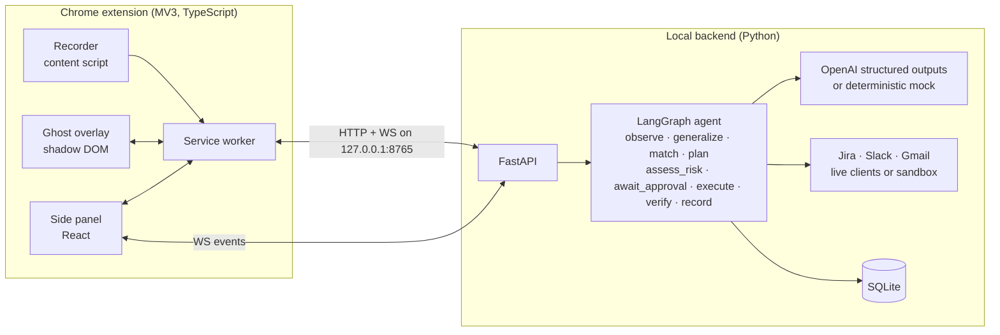

# REPEAT

[](https://github.com/Mohammad-Umar7/repeat/actions/workflows/ci.yml)

**Show it once. Then just press Tab.**

REPEAT is an AI agent that lives inside the browser where work already happens. It is not a
chatbot. You show it a multi-step workflow once (read a bug report email, create a Jira
ticket, post a Slack message) and it turns that demonstration into a reusable automation.
The next time the same kind of email appears, a ghost cursor shows up and pre-fills the
whole workflow in grey, like autocomplete for clicks and forms. **Tab** to accept, **Esc** to
dismiss. Every action lands on a timeline with a single undo slider that reverts the whole
run across every app at once.

> Hackathon build, written net-new in this repo. [BUILD_LOG.md](BUILD_LOG.md) has the
> timestamps; [ARCHITECTURE.md](ARCHITECTURE.md) has the LangGraph nodes, failure handling
> and undo tokens.

## The three core experiences

### 1. Teach mode: show it once
Click **Teach** in the side panel and do the task by hand. The extension records a clean
semantic event stream, not a screen recording: copies (with source page), pastes, typed
values with their field labels, primary-button clicks and navigations, all timestamped.
Optionally narrate while you work ("this sender is the reporter"); narration is transcribed
and time-aligned to the events so the agent learns intent, not just actions. Press **Done**
and the agent generalises the demonstration into a workflow card: trigger, ordered steps and
variables mapped from source to destination. Rename it if you like.

### 2. Ghost mode: autocomplete for work
Open an email that matches a learned trigger. A ghost cursor appears with a pill: *REPEAT can
finish this. Tab to run, Esc to dismiss.* Press Tab and you see one risk summary for the whole
run ("Creates 1 Jira issue, posts 1 message to #product-updates, no external emails, no
payments"). Then the cursor glides to Jira and the fields fill in grey, one by one. Tab
commits the step through the real Jira API and the real ticket key appears. The cursor moves
to Slack, drafts the message with that key inside it, Tab posts it. ⇧Tab runs the whole chain.

### 3. Undo slider: Ctrl+Z for your whole day
The Live Run view shows the timeline with a green check on every verified step and the time
saved. Drag the slider back and the steps revert in reverse order through the APIs: the Slack
message is deleted, the Jira issue is deleted, the email label is removed. Each revert is
verified before the badge turns to *reverted*. Ctrl+Z steps back one action.

Every automated action is previewable, approvable, verifiable and reversible. That is the
product, not a feature.

## Architecture



Local-first: demonstrations, workflows and run timelines live in a SQLite file on your
machine. The only things that leave are the LLM calls needed to generalise and run a
workflow, and calls to the official Jira, Slack and Gmail APIs when you approve a run.

## Setup (under 10 steps)

Prerequisites: Python 3.11+, Node 20+, Chrome 120+.

1. Clone the repo and open a terminal in it.
2. Backend dependencies:
   ```bash
   cd backend && python -m pip install -r requirements.txt
   ```
3. Configuration: copy `.env.example` to `backend/.env`. For the stage demo leave
   `REPEAT_DEMO_MODE=true` (sandboxed Jira/Slack/Gmail with realistic IDs, zero network). For
   live apps set it to `false` and fill in the Jira token, Slack bot token and Gmail OAuth
   client path. Add `OPENAI_API_KEY` to use the model; without it a deterministic provider is
   used so the demo never depends on the network.
4. Start the backend:
   ```bash
   cd backend && python -m repeat
   ```
   It seeds the learned workflow "Bug email to Jira and Slack" on first boot and listens on
   `http://127.0.0.1:8765` (`/docs` for the API, `/health` for integration status).
5. Build the extension:
   ```bash
   cd extension && npm install && npm run build
   ```
6. Load it: open `chrome://extensions`, enable Developer mode, **Load unpacked**, pick
   `extension/dist`.
7. Pin REPEAT and click its icon (or press **Alt+R**). The side panel opens on the
   Workflows view with the seeded card.
8. Open Gmail, Jira and Slack in tabs. Open a bug-report email, or press **Check inbox &
   run** in the panel to fetch the newest one.
9. Reset between takes with one command:
   ```bash
   ./scripts/reset-demo.sh        # macOS / Linux / Git Bash
   ```
   ```powershell
   .\scripts\reset-demo.ps1       # Windows
   ```

Or do steps 2 to 5 in one go with `./scripts/dev.sh` (macOS/Linux/Git Bash) or
`.\scripts\dev.ps1` (Windows): it creates `backend/.env` in demo mode if missing, builds the
extension and starts the backend.

`.env.example` documents every key.

## The 2-minute demo

| Time | What happens |
|---|---|
| 0:00 | Side panel open on **Workflows**. One card: *Bug email to Jira and Slack*, showing trigger, three steps and five variables. |
| 0:15 | A new bug report email arrives in Gmail. Open it. The ghost cursor appears with the pill *REPEAT can finish this. Tab to run, Esc to dismiss.* |
| 0:25 | Press **Tab**. The risk summary shows for 2 s. The cursor glides to Jira, Summary and Description fill in grey one by one. Press **Tab**: the issue is created through the Jira API, verified, and the real key (e.g. `DEMO-142`) appears. |
| 0:50 | The cursor glides to Slack. The message drafts in grey with the real ticket key inside it. **Tab**. It posts to `#product-updates`. |
| 1:05 | The panel's **Live Run** view shows the completed timeline, a green check on every step and the time saved. |
| 1:20 | Drag the undo slider back. The Slack message disappears, the Jira issue disappears, the label comes off the email, and the checks turn into *reverted* badges, each confirmed through the API. |
| 1:40 | Press **Teach**, then **Start teaching**. The recording indicator counts events as you click around for ten seconds. Cancel or Done. |
| 1:55 | End on the workflow card. |

Demo mode makes this deterministic: `REPEAT_DEMO_MODE=true` sandboxes the three apps, the
seed writes the learned workflow and three inbox emails (two bug reports, one lunch invite
that correctly does *not* match), and `scripts/reset-demo` restores everything in under a
second. A one-shot fault can be armed with `POST /demo/fault {"app":"jira"}` to show the
paused state with retry / skip / stop.

## Keyboard

| Key | Where | Does |
|---|---|---|
| Tab | ghost pill / panel | Accept: run step by step, or commit the previewed step |
| ⇧Tab | ghost pill / panel | Run all remaining steps |
| Esc | ghost / panel | Dismiss the offer, stop the run, cancel teaching |
| Enter | panel | Confirm: start/finish teaching, retry a paused step, run first workflow |
| S | paused state | Skip the failed step |
| Ctrl+Z / Cmd+Z | Live Run | Undo the last committed step |
| Alt+R | anywhere | Open the side panel |

## Repo layout

```
backend/            FastAPI + LangGraph + SQLite + integrations (Python)
  repeat/agent/     graph.py, nodes.py, runner.py, undo.py, schemas.py
  repeat/prompts/   versioned prompts (v1/generalize|match|plan|assess_risk.md)
  repeat/integrations/  jira.py, slack.py, gmail.py, sandbox.py
  tests/            end-to-end graph tests (pytest)
extension/          Chrome MV3 extension (TypeScript, React)
  src/background/   service worker
  src/content/      recorder.ts, ghost/ (shadow-DOM overlay)
  src/sidepanel/    React panel: Workflows, Live Run, Teach
scripts/            reset-demo.sh / reset-demo.ps1
```

## Tests

```bash
cd backend && python -m pytest -q
```

Covers the full run in step mode and run-all mode, the no-match case, a failure that pauses
then succeeds on retry, skip-and-continue, full undo and single-step undo.

## License

MIT.
